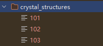
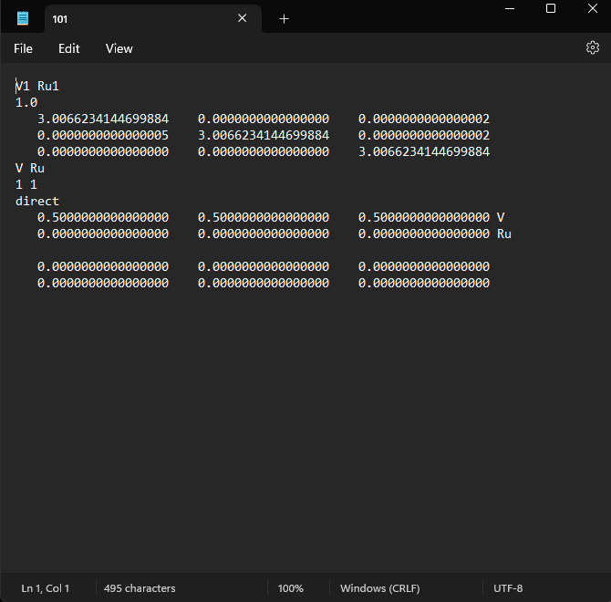
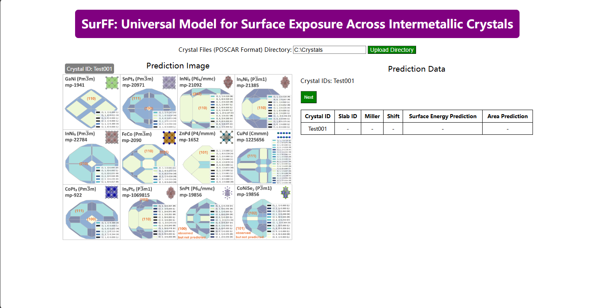

# Web UI Guide
Please first install the required packages and download the core data files before running the web UI.

## Crystal Files Preparation
Please prepare the crystal files as POSCAR files in a folder.
The POSCAR files should be named using unique integer numbers.
 



## Start the Web UI
Run the following command in the terminal:
```bash
cd ocp
python app.py
```
Then simply click the browser link provided in the terminal.

## Usage

Upload the POSCAR files by input the folder path and click the "Submit" button.


Wait for the prediction results. The results will be displayed in the table.