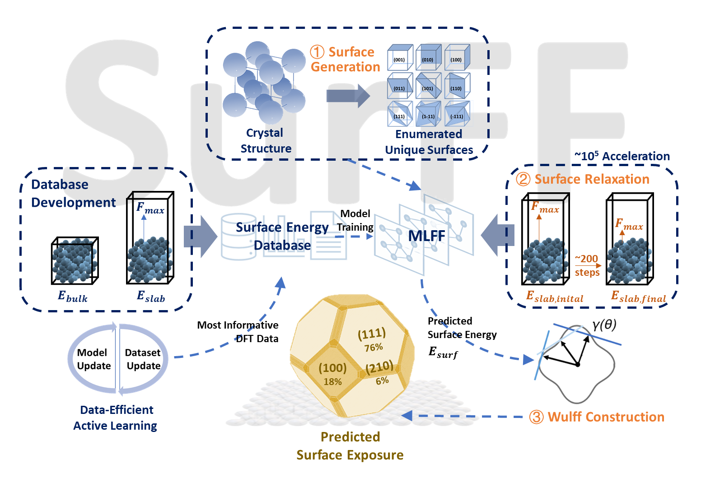
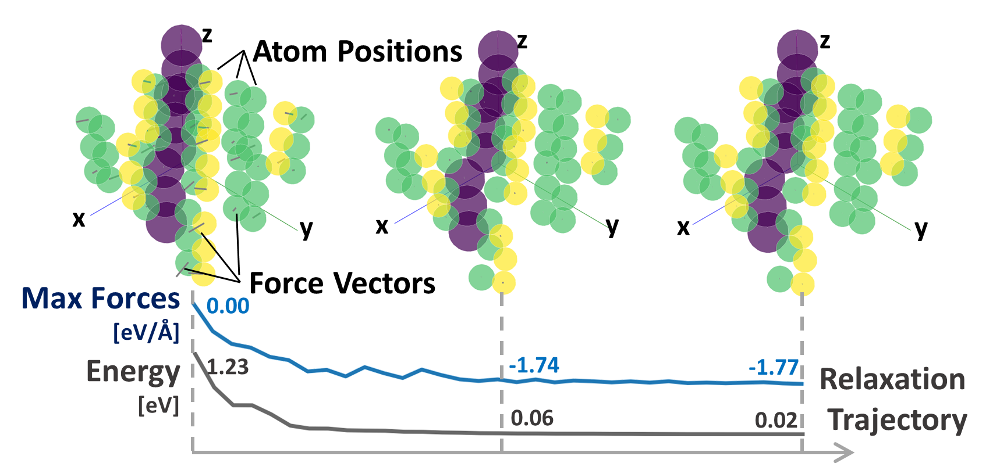
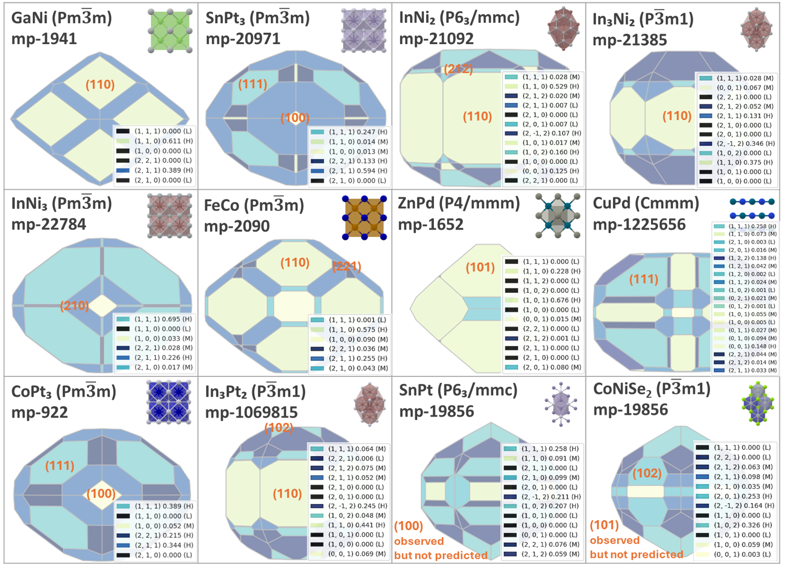

# SurFF: Universal Model for Surface Exposure and Synthesizability Across Intermetallic Crystals

## About the Project 

-----------------

This github is for the project: Intermetallic Crystal Nanoparticle Model for 
Predicting Surface Energy and Synthesizability for Catalyst Discovery.

We developped intermetallic surface energy database, featuring 12,553 entries and 344,200 DFT 
single points. Based on 
the database, we trained a machine learning force field model to achieve 10^5 times speedup in 
DFT relaxations for surface energy calculations.
The model aims to provide fast and accurate surface exposure and synthesizability information 
of intermetallic nanoparticles for large scale catalyst screening and catalyst discovery





## Installation

------------

Clone the repository and install the required packages using the following commands:
```bash
git clone https://github.com/Long1Corn/Intermetallic_Crystal_Nanoparticle_Model.git

cd Intermetallic_Crystal_Nanoparticle_Model

bash install.sh
```

Required - Download files of the dataset, the trained models, and results:
```bash
python download_data.py
```


## Dataset

--------------------
- The relaxation trajectory is provided in [Data/Surface/Traj](Data/Surface/Traj) folder.
- We also provide the calculated surface energy in [Data/Surface/Surface_Energy](Data/Surface/Surface_Energy) folder.
- The coresponding structure files are provided in [Data/Surface/Structure](Data/Surface/Structure) folder.





Summary of intermetalic surface datasets generated in this work.

| Dataset      | Surfaces | DFT single point | DFT time (cpu-hr) | Notes                                                                     | File Location                      |                                                             
|--------------|----------|------------------|-------------------|---------------------------------------------------------------------------|------------------------------------|
| Train set    | 9,676    | 262,984          | 155,612           | Mode training;                                                            | [train_lmdb](ocp/data/train)       |
| AL test set  | 1,865    | 49,295           | 28,371            | Evaluate accuracy while dataset generation; Test surface energy accuracy; | [test_al_lmdb](ocp/data/test/al)   |
| ID test set  | 327      | 7,995            | 2,642             | Test surface energy accuracy; Test surface area accuracy;                 | [test_id_lmdb](ocp/data/test/id)   |
| OOD test set | 685      | 23,926           | 7,576             | Test surface energy accuracy; Test surface area accuracy;                 | [test_ood_lmdb](ocp/data/test/ood) |
| Pred set     | 144,191  | -                | -                 | Predict surface energy and area for intermetallic crystals;               | [pred_lmdb](ocp/data/relax/all)    |


## Model

-------------------
- All the trained model are provided via [saved_model](Data/saved_model) folder.

Relaxation Results

| Model    | Dataset | MAE (meV/Ų) | Fraction | Energy | L    | M    | H    | Top3 | Top5 | GPU Time (hr) |
|----------|---------|--------------|----------|--------|------|------|------|------|------|---------------|
| Base     | OOD     | 10.5         | 0.074    | 0.669  | 0.633| 0.661| 0.744| 0.666| 0.810| 0.27          |
| Base     | ID      | 2.9          | 0.032    | 0.734  | 0.772| 0.627| 0.803| 0.800| 0.810| 0.12          |
| Base     | AL      | 3.8          | -        | -      | -    | -    | -    | -    | -    | 0.69          |
| Finetune | OOD     | 6.8          | 0.080    | 0.675  | 0.666| 0.605| 0.744| 0.700| 0.820| 0.26          |
| Base     | Pred    | -            | -        | -      | -    | -    | -    | -    | -    | 115           |


Single Point Results

| Model    | Dataset | Force MAE | Force Cos | Energy MAE |
|----------|---------|-----------|-----------|------------|
| Base     | OOD     | 0.1949    | 0.3039    | 2.3473     |
| Base     | ID      | 0.0334    | 0.5594    | 0.3229     |
| Base     | AL      | 0.0472    | 0.5338    | 0.4199     |
| Finetune | OOD     | 0.0902    | 0.3814    | 1.2926     |


## Predictions

----------------------------
- By applying SurFF, we provide the surface energy and exposure information for over 6,000 intermetallic crystals and 14 thousands surfaces.
The results are provided in [results/all](results/all) folder.
- Example predictions and comparison with experimental observations.



## Usage

----------------------------
[Example](Example_Usage.ipynb) of using the model to predict surface exposure and area for intermetallic crystals.


## License

----------------------------
Distributed under the MIT License. See LICENSE.txt for more information.

## Contact

----------------------------
Yin Jun - yinjun98@u.nus.edu
Chen Honghao - chh22@mails.tsinghua.edu.cn
